# Performance Testing - JMeter

1. /all-student
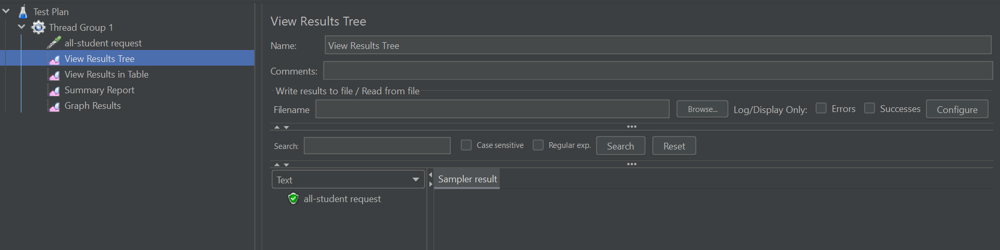
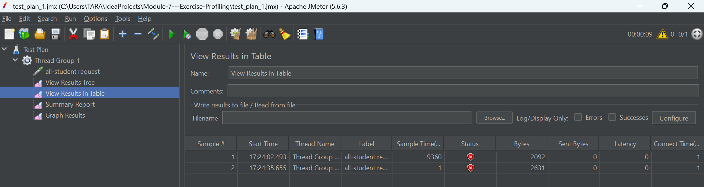
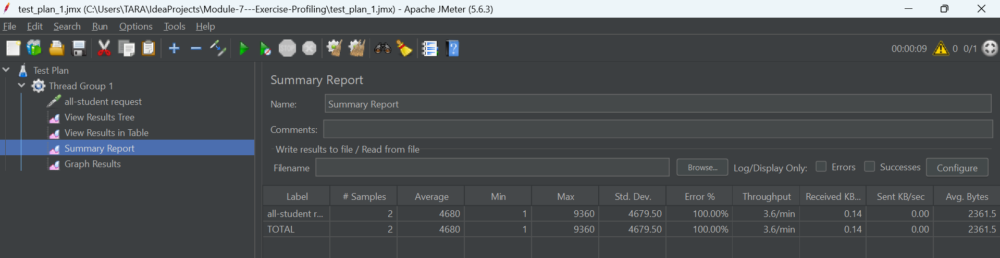
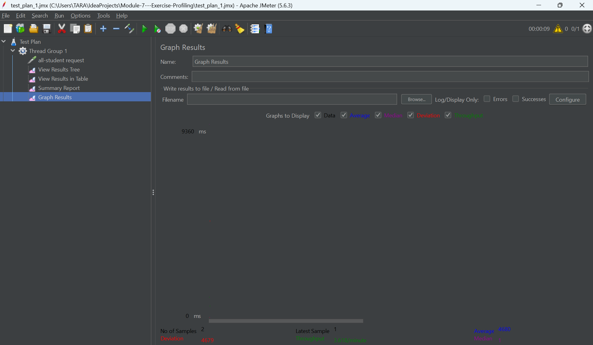

2. /all-student-name
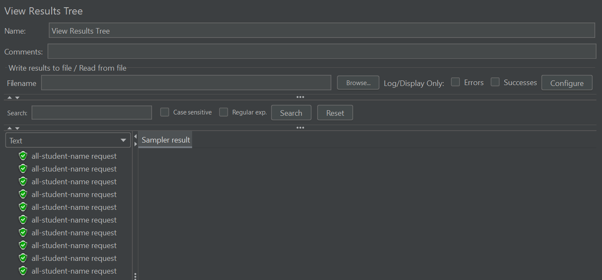
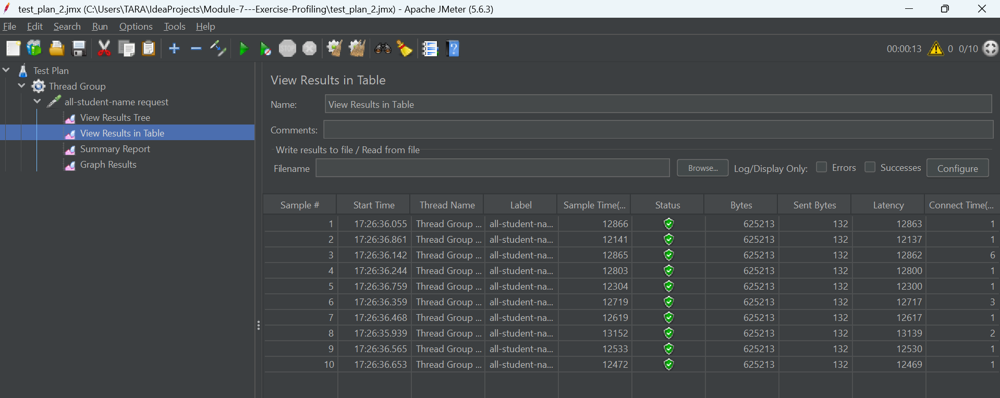
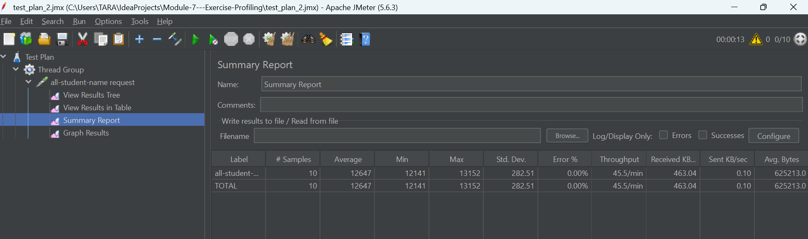
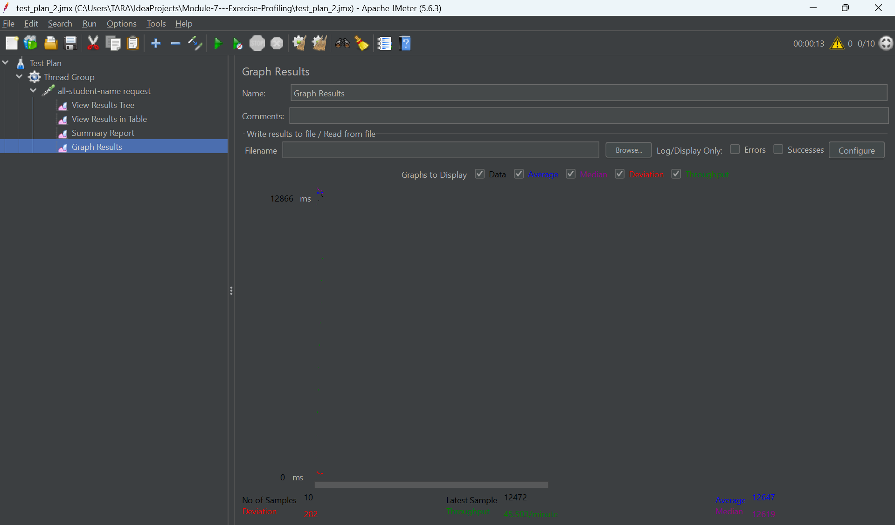

3. /highest-gpa
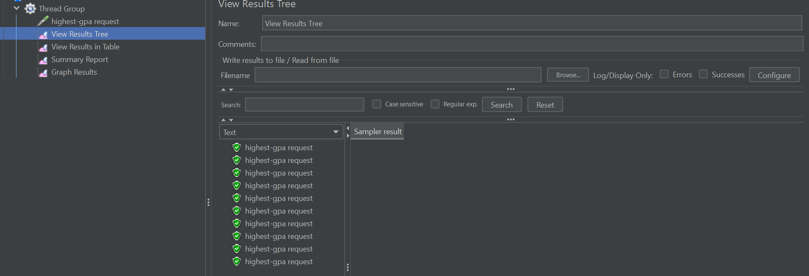
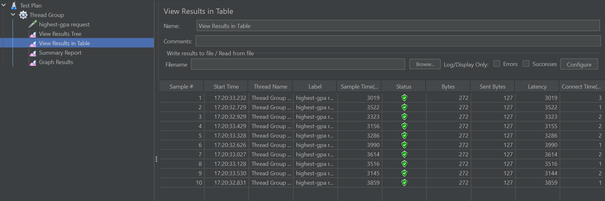
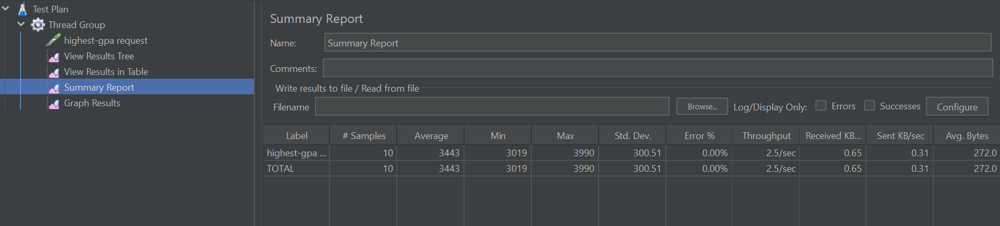
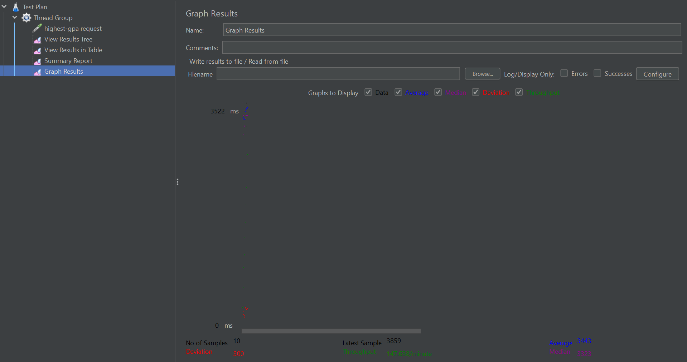

Analysis
- /all-student is the slowest because it returns all data
- /all-student-name is faster because it returns fewer fields
- /highest-gpa is the fastest since it only returns one result

# command Line Results
/all-student
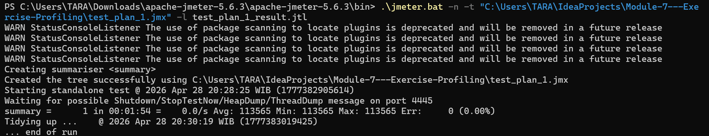
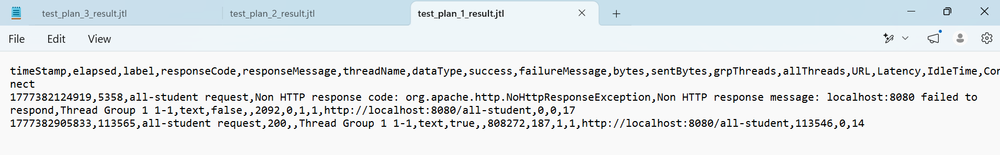

/highest-gpa
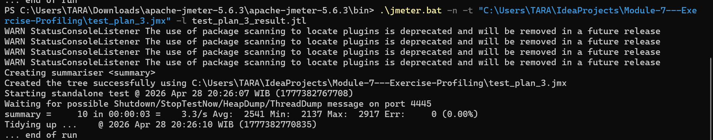
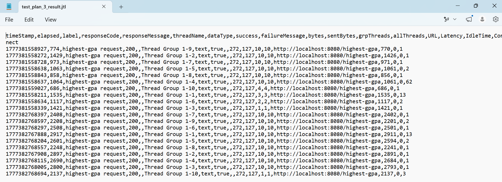

/all-student-name
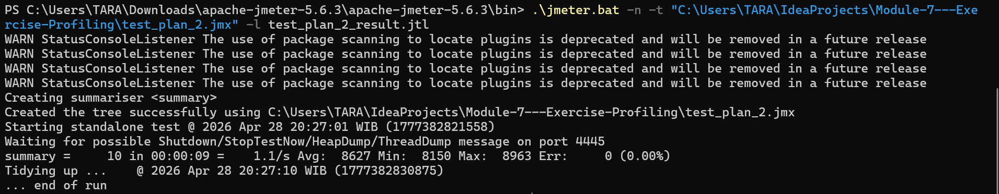
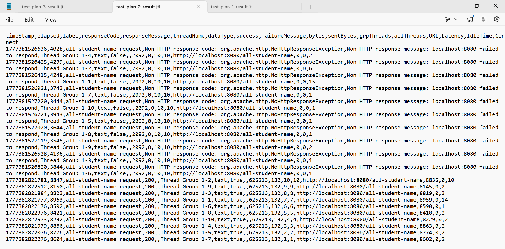

Performance Comparison
After optimization, the JMeter results show better performance compared to the initial run. 
The response time is lower and throughput is more stable, which means the optimization reduced unnecessary database calls and improved efficiency.

Reflection
1. JMeter focuses on testing performance from outside (like real users hitting endpoints), while IntelliJ Profiler looks inside the code to see which methods are slow or consuming resources.
2. Profiling helps me clearly see which method is taking the most time (like getAllStudentsWithCourses), so I know exactly what to optimize instead of guessing.
3. Yes, it’s effective because it directly shows CPU usage and execution time per method, making bottlenecks obvious.
4. The main challenge was inconsistent results and setup issues (like server not running or JMeter errors). I handled it by rerunning tests and making sure the app is stable before testing.
5. The biggest benefit is visibility, I can see exactly where time is spent, not just that something is slow.
6. I compare both: JMeter shows overall performance, profiler shows internal cause. If they don’t match, I recheck test conditions and run multiple times.
7. I optimized by reducing repeated database calls and using better queries. To make sure nothing breaks, I kept the logic the same and only changed how data is fetched.